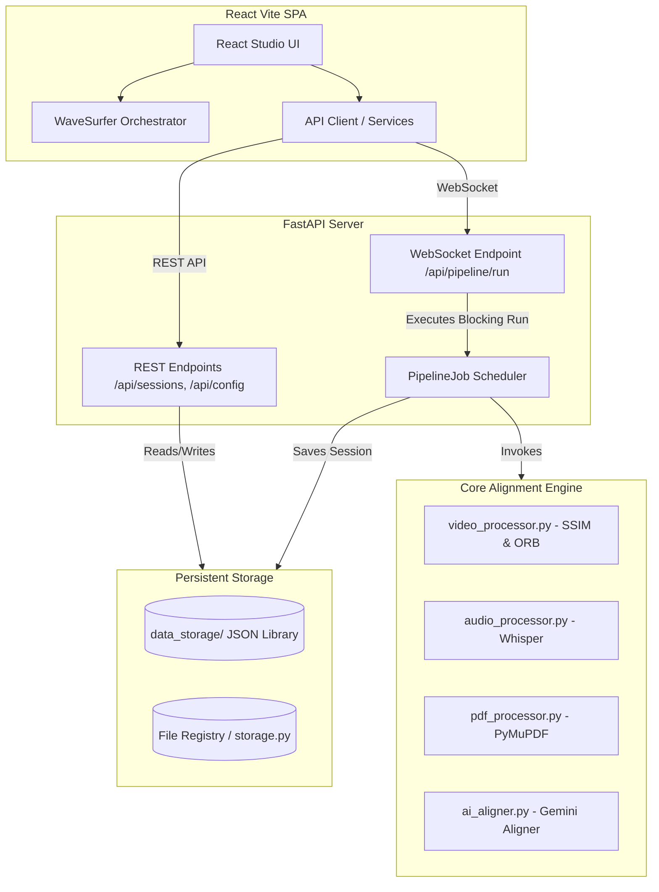

# 🏗️ Architecture & Core System Design

This document describes the architectural layout, data flow, and key component interfaces of the **Contextualizing Lectures** system. It is designed to help both developers and AI agents build and maintain features without introducing regressions.

---

## 1. High-Level Architecture Overview

The application is structured as a decoupled **FastAPI + React SPA** system.



*   **FastAPI Backend (`server.py`)**: Mounts REST endpoints for configuration, metadata management, and session retrieval. It hosts a stateful WebSocket endpoint to run alignment pipelines asynchronously.
*   **Decoupled Core (`core/`)**: Module containing isolated processors for video frame parsing, transcript generation, PDF processing, and LLM-based alignment.
*   **Vite React Frontend (`frontend/`)**: Renders the timeline UI editor, visualizes alignment segments, handles file uploads, and manages audio playback.

---

## 2. Decoupled Core Components

The backend logic resides in the `core/` package. Individual files have high cohesion and represent distinct processing steps:

### A. The Thread-Safe Cancelable Scheduler (`core/pipeline.py`)
*   **Class**: [PipelineJob](file:///s:/WorkSpace/Git%20Workspace/AI%20Project/Contextualizing-Lectures/core/pipeline.py#L15)
*   **Role**: Orchestrates the multi-stage alignment pipeline from a thread executor.
*   **Lifecycle**:
    1.  **Preflight Checks**: Warm-up dependencies using lazy loading checks in `core/system_loader.py`.
    2.  **PDF Extraction**: Render slide PDF to images and extract slide text.
    3.  **Video Processing (Visual Mode)**: Track visual slides and transitions (if MP4 video uploaded).
    4.  **Audio Transcription**: Run local Whisper or Gemini AI transcription.
    5.  **Alignment Fusion**: Align generated transcripts with extracted slides using Google Gemini LLM.
    6.  **Waveform Visualizer Peaks**: Generate peak files from media via `core/audio_analysis.py`.
*   **Cancellation Event**: Uses `threading.Event()` passed from `server.py`. The WebSocket reader monitors disconnects. If set, [PipelineJob.send_status](file:///s:/WorkSpace/Git%20Workspace/AI%20Project/Contextualizing-Lectures/core/pipeline.py#L48) raises `PipelineCancelledError`, breaking the execution loop cleanly.

### B. Core Aligners (`core/ai_aligner.py`)
*   **Functionality**: Groups transcription segments, formats extracted slides into prompt payloads, and queries the Gemini LLM to align segments with slide indices.
*   **Out-of-Bounds Coercion**: Coerces LLM slide number responses that exceed the total slide count down to safety boundaries (or 0 for off-topic content) to avoid UI crashes.

### C. Visual Frame Matchers (`core/video_processor.py`)
*   **Functionality**: Extracts frames from videos at a configured rate. Applies Structural Similarity Index (SSIM) threshold comparison to isolate scene cuts. Leverages ORB feature extraction and RANSAC geometric matching to map video frames to PDF slide images.

---

## 3. Data Schemas & Persistence

### A. Directory Structure Layout
All session records and media uploads are structured systematically under `data_storage/`:

```text
data_storage/
├── files/
│   ├── documents/      # Uploaded PDF files
│   └── media/          # Uploaded MP4/MP3 media files
├── tmp/                # Session temp files (e.g., slide images, extracted audio chunks)
└── library/            # Saved session metadata JSON records (session_[uuid].json)
```

### B. Path Portability
To ensure paths are portable across different machines and agents:
*   Always call `core.storage.resolve_data_path(rel_path)` to get absolute operating-system paths dynamically.
*   Do **NOT** hardcode paths starting with `/` or local directories.

### C. Data Schemas (`core/schemas.py`)
Data structures are defined via Pydantic models for validation and serialization:
*   `SlideSchema`: Extracted slide representations `{ page_number, title, text }`.
*   `TranscriptSegmentSchema`: Transcribed audio segments `{ id, start, end, text }`.
*   `FinalAlignmentSchema`: Unified alignment items mapping a timeline segment to slide indices:
    *   `slide_number`: Index of matching slide (0 = off-topic).
    *   `slide_title`: Slide heading.
    *   `exact_transcript`: Spoken words.
    *   `ai_insight`: Generated summary or context.
    *   `timestamp_start`: Start boundary in seconds.
    *   `timestamp_end`: End boundary in seconds.
    *   `is_off_topic`: Boolean flag.

---

## 4. Frontend & WaveSurfer UI Orchestrator

The desktop studio timeline represents the core client visualization component:

*   **Hook**: `frontend/src/hooks/useWaveSurfer.ts`
    *   Initializes the WaveSurfer.js player instance.
    *   Exposes properties to sync the active playback timestamp with visual slide regions.
*   **Slide Snapping & Timeline Components**:
    *   `SlideTimeline`: Renders visual boundaries along the timeline. Displays blue/purple highlight cards for playing or related segments.
    *   `SlideJumpPills`: Quick links allowing users to click a pill to jump directly to that slide's segment on the timeline.
*   **Reverse Proxy Dev Server**:
    *   Vite (`frontend/vite.config.ts`) proxies requests from `/api`, `/data`, and `/tmp` back to port 8000, preventing CORS issues in the local development environment.

---

## 5. External System Dependencies

Ensure the local host system has the following requirements configured:
1.  **FFmpeg**: Must be available on the system's PATH. Used for audio extraction and media format conversion.
2.  **Gemini API Key**: Set in the configuration dashboard or via standard environment variables.
3.  **PyMuPDF / OpenCV**: Python dependencies required for PDF parsing and Computer Vision execution.
